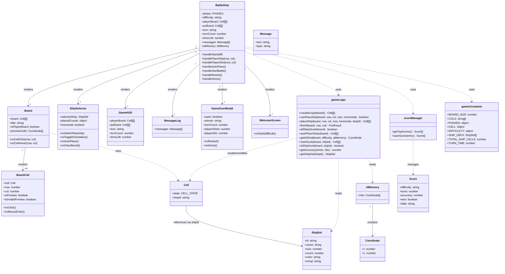

# ⚓ Batalla Naval

Juego clásico de Batalla Naval para navegador, jugador contra PC, con IA adaptativa y diseño naval inmersivo.

---

## 🎮 ¿De qué trata?

Coloca tu flota en el tablero y destruye todos los barcos enemigos antes de que hundan los tuyos. Dispones de 15 segundos por turno o el disparo se realiza automáticamente. El juego incluye 3 niveles de dificultad con una IA que aprende de sus impactos.

---

## 🚢 Características

- **Tablero 10×10** con coordenadas alfanuméricas (A–J / 1–10)
- **4 tipos de barcos**: Portaviones (5), Acorazado (4), Submarino (3), Destructor (2)
- **3 niveles de dificultad**:
  - 🟢 Fácil — disparos aleatorios
  - 🟡 Normal — IA busca celdas adyacentes al impacto
  - 🔴 Difícil — IA detecta la dirección del barco y lo remata
- **Temporizador por turno** (15 s) con disparo automático
- **Vista previa** de colocación de barcos con indicador de validez
- **Colocación automática** de barcos con un clic
- **Registro de batalla** en tiempo real
- **Modal de fin de partida** con estadísticas (precisión, turnos, disparos)
- **Tabla de mejores partidas** guardada en localStorage
- Diseño **responsive** (móvil y escritorio)

---

## 🛠️ Tecnologías

| Tecnología | Uso |
|---|---|
| **React 18** | Framework principal de UI |
| **Tailwind CSS** | Estilos y diseño responsivo |
| **shadcn/ui** | Componentes de UI (Button, Dialog, Progress…) |
| **Radix UI** | Primitivos de accesibilidad |
| **Lucide React** | Íconos |
| **Framer Motion** | Animaciones |
| **React Router DOM** | Navegación |
| **TanStack Query** | Gestión de estado del servidor |
| **Google Fonts (Orbitron + Inter)** | Tipografía temática |

---

## 📁 Estructura del proyecto

```
src/
├── pages/
│   └── BattleShip.jsx          # Página principal del juego
├── components/
│   └── battleship/
│       ├── Board.jsx            # Tablero de juego
│       ├── BoardCell.jsx        # Celda individual
│       ├── ShipSelector.jsx     # Panel de selección de barcos
│       ├── GameHUD.jsx          # Indicadores de estado
│       ├── MessageLog.jsx       # Registro de batalla
│       ├── WelcomeScreen.jsx    # Pantalla de inicio
│       └── GameOverModal.jsx    # Modal de fin de partida
├── lib/
│   ├── gameConstants.js         # Constantes del juego
│   ├── gameLogic.js             # Lógica de juego e IA
│   └── scoreManager.js          # Gestión de puntuaciones
└── index.css                    # Variables de diseño y tema naval
```

---

## 🎯 Cómo jugar

1. Elige la dificultad en la pantalla de inicio.
2. Coloca tus barcos en el tablero izquierdo haciendo clic. Pulsa **R** para rotar.
3. Usa el botón **Auto** para colocación aleatoria automática.
4. Pulsa **Iniciar Batalla** cuando todos los barcos estén colocados.
5. Haz clic en el tablero enemigo para disparar. ¡Tienes 15 segundos por turno!
6. Hunde toda la flota enemiga para ganar.

---

## 📐 Diagrama de Casos de Uso

```mermaid
flowchart TD
    Jugador(["👤 Jugador"])
    PC(["🤖 PC (IA)"])
    Sistema(["⚙️ Sistema"])

    Jugador --> UC1["Iniciar nueva partida"]
    Jugador --> UC2["Seleccionar dificultad"]
    Jugador --> UC3["Colocar barcos manualmente"]
    Jugador --> UC4["Colocar barcos automáticamente"]
    Jugador --> UC5["Rotar barco (tecla R)"]
    Jugador --> UC6["Limpiar tablero"]
    Jugador --> UC7["Iniciar batalla"]
    Jugador --> UC8["Disparar al tablero enemigo"]
    Jugador --> UC9["Ver registro de batalla"]
    Jugador --> UC10["Ver estadísticas finales"]
    Jugador --> UC11["Ver mejores partidas"]
    Jugador --> UC12["Reiniciar / Volver al inicio"]

    PC --> UC13["Disparar al tablero del jugador"]
    PC --> UC14["Modo caza: disparo aleatorio"]
    PC --> UC15["Modo objetivo: disparar adyacente"]
    PC --> UC16["Modo difícil: detectar dirección"]

    Sistema --> UC17["Validar colocación de barco"]
    Sistema --> UC18["Controlar temporizador de turno"]
    Sistema --> UC19["Detectar barco hundido"]
    Sistema --> UC20["Verificar condición de victoria"]
    Sistema --> UC21["Guardar puntuación en localStorage"]

    UC1 --> UC17
    UC7 --> UC18
    UC8 --> UC19
    UC13 --> UC19
    UC19 --> UC20
    UC20 --> UC21

    UC13 -.->|Fácil| UC14
    UC13 -.->|Normal| UC15
    UC13 -.->|Difícil| UC16
```



---

## 🏗️ Diagrama de Clases



---

## 📜 Licencia

MIT